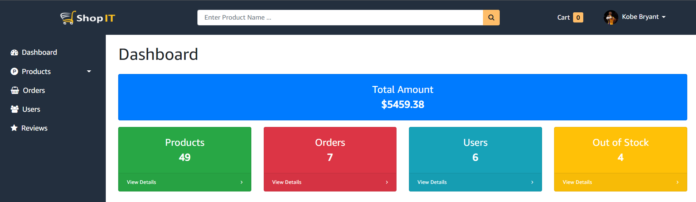
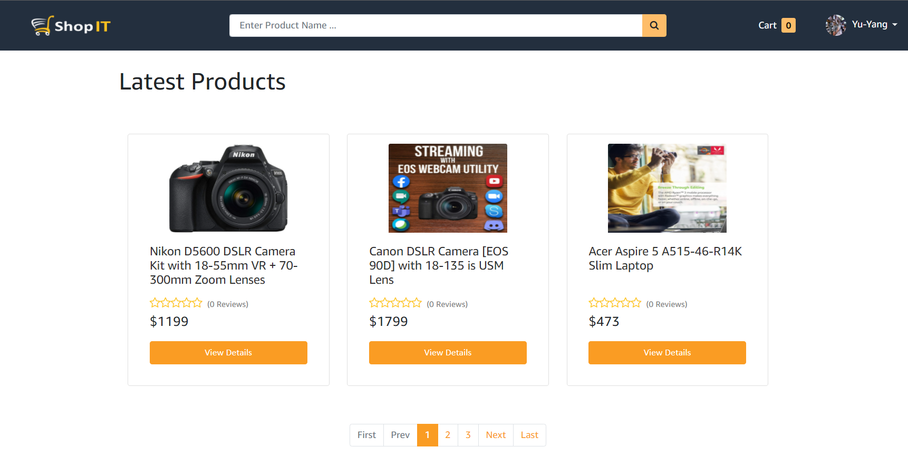

# SHOPIT-E-COMMERCE-SITE-FULLSTACK

## Table of contents

- [Overview](#overview)
  - [App features](#app-features)
  - [Screenshot](#screenshot)
  - [Links](#links)
- [My process](#my-process)
  - [Built with](#built-with)
  - [What I learned](#what-i-learned)
- [Author](#author)

## Overview

### App features

- Admin email:  **yuyangtest@test.com** ,password:  **yuyangtest**.
- Test credit card number:**4242 4242 4242 4242** ,CVC number: **Any 3 digits**
- Login as Admin to get access to **admin dashboard** ,admin can do **CRUD actions** to **products,users and orders**.
  
- **Send password reset token email** when forgot password.(Can only work in dev mode using mailtrap)

- User can use **category,price,keyword** to search products .
  
- User can leave **review** on each products .
- User can upload **custom picture** for user profile .
- If user close page without log out ,will **auto login** next time visit the page.

### Screenshot

### Links

- Live Site URL: [Live site hosted here](https://shopit-mern-fullstack.herokuapp.com/)

## My process

### Built with

- Semantic HTML5 markup
- [Bootstrap](https://getbootstrap.com/)- For styles
- [cloudinary](https://cloudinary.com/)-Media cloud platform
- [React](https://reactjs.org/) - JS library
- [Redux toolkit](https://redux-toolkit.js.org/)
- Save data in [MongoDB Atlas](https://www.mongodb.com/cloud/atlas/lp/dcp?utm_content=rlsapostreg&utm_source=google&utm_campaign=gs_apac_rlsamulti_search_brand_dsa_atlas_desktop_rlsa_postreg&utm_term=&utm_medium=cpc_paid_search&utm_ad=&utm_ad_campaign_id=14412646494&adgroup=131761134852&gclid=CjwKCAiA6seQBhAfEiwAvPqu11uB5hKwhVkK15IX2OdUAg84yrrNDn7a_z78ec_9RSCOn5AguzJclhoCiGIQAvD_BwE) database
- [Mongoose](https://mongoosejs.com/)
- [NodeJS](https://nodejs.dev/)
- [Express](https://expressjs.com/zh-tw/)
- Deploy by [heroku.com](https://www.heroku.com/)

### What I learned

Learn how to design and implement **RESTful API** ,interact with **NoSQL database**, actually understanding **Security issue** about web applicaiton, using **Redux toolkit** to manage state on frontend , manage media assets with [cloudinary](https://cloudinary.com/) platform,**Error handling**,**HOC**,....

## Author

- Website - Well I haven't made my profile portfolio, gonna make it sooon when I know a lot of stuffs
- Yu-Yang - [@jasons0900107315@gmail.com](https://www.google.com/gmail/about/)
